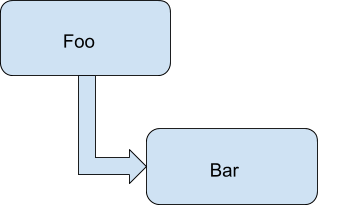
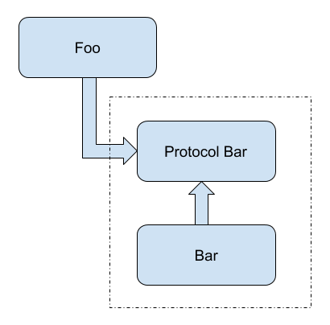
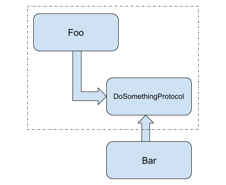

# Dependency Inversion Principle

According to Wikipedia, Dependency Inversion Principle is stated as:

    A. High-level modules should not depend on low-level modules. 
    	 Both should depend on abstractions (e.g. interfaces).
    B. Abstractions should not depend on details. 
        Details (concrete implementations) should depend on abstractions.


### Why do we need to use Dependency Inversion Principle?
- Rather than working with a set of classes that are tightly coupled to each other, you want to work with a standard interface. 
- You want to ensure that you can replace the implementation without violating the expectations of that
interface, according to LSP. So, if you’re working with an interface and you want to be able to replace it, then you
need to ensure that you are only working with the interface and never with a concrete implementation. 
That is, the code that relies on the interface should only ever know about the interface. It should not know about any of the specific
classes that implement the interface.
This also helps with creating mocks and testing.
But, decoupling a class from its concrete dependencies is what Dependency Inversion Principle helps us with.


#### High-level modules, low-level modules and Abstraction Ownership
Going back to the principle statement, it's clear that,
    High-level modules define the contract using an abstraction, i.e. a protocol. 
    The low-level modules implement this protocol and is dependent on it.


### How to remove tight-coupling by inverting dependencies?

Consider the following example:

```
  class Foo {
    let bar: Bar

    func fooShouldDoSomething() {
      bar.doSomething()
    }
  }
```

Standard object graph where you see the higher-level object is dependent on and tightly coupled to the lower-level object.

##### Tradional dependency
   
<center></center> 

This is standard dependency, where you can't use `Foo` without `Bar`.

So, naturally we introduce a protocol `ProtocolBar`, which `Foo` can depend on and `Bar` to implement.
This `ProtocolBar` can be created from the public API of the `Bar` class.

##### Dependency Injection

```
  protocol BarProtocol {
    func doSomething()
  }

  class Bar : BarProtocol {
    func doSomething() {
      // does something interesting...
    }
   }
```

```
  class Foo {
    let bar: BarProtocol

    func fooShouldDoSomething() {
      bar.doSomething()
    }
  }
```

<center></center> 


You've successfully decoupled the implementation of `Bar` from the use of it in `Foo` by the protocol usage.
However, you’ve only decoupled the implementation by separating the interface from it. You haven’t inverted the dependency structure yet and you haven’t corrected all of the coupling problems in this setup.

Problems?

- What happens when you want to update `Bar` in this scenario?

`Bar` owns the `BarProtocol` and can change/update it. Depending on the change you want to make, you could've a rippling effect that causes you to change the `BarProtocol` interface. 
`Foo` depends on the `BarProtocol` interface, so you must change the implementation of `Foo` as well. You may have decoupled the implementation of `Bar`, but you have left `Foo` dependent on changes to `Bar`. 

If you want to invert the dependency structure here, then you must first change your perspective. The developer working with this system must understand that you should not merely abstract the implementation away from the interface. Yes, this separation is necessary, but it is not sufficient. You must understand who owns the abstraction.


##### Dependency Inversion

```
  protocol DoSomethingProtocol {
    func doSomething()
  }

  extension Bar : DoSomethingProtocol { }

  class Foo {
    let bar: DoSomethingProtocol

    func fooShouldDoSomething() {
      bar.doSomething()
    }
  }
```

  - Nothing may have changed structurally, but the perspective of ownership has shifted.

<center></center> 

If `Foo` owns the `DoSomethingProtocol` abstraction, you can place these two constructs in a package that is independent of `Bar`. You can put them into their own namespace, their own assembly, etc. 
This can greatly increase the illustration of what class or module is dependent on the other. 
If you see that AssemblyA contains `Foo` and `DoSomethingProtocol`, and AssemblyB provides the implementation of `DoSomethingProtocol`, it is easier to see that the detail of `Bar` is dependent on the policy defined by `Foo`.

When you have the dependency structure inverted correctly, the ripple effect of changing the policy and/or detail is now correct as well. When you change the implementation of `Bar`, you are no longer seeing an upward ripple of changes. This is due to `Bar` being required to conform to the abstraction provided by Foo-the detail is no longer dictating changes to the policy. Then, when you change the needs of `Foo`, causing a change in the `DoSomethingProtocol` interface, you now have changes that ripple down the structure. Bar will be forced to change based on the policy changing.

Naming the protocol based on what its intent is, can also help in acheiving Dependency Inversion Principle.


### Dependency Injection vs Dependency Inversion

So now its clear that,
    
- Dependency Injection is a technique for supplying objects (dependencies) to a class.
- Dependency Inversion is broadly about de-coupling a class from its concrete dependencies.


However at run time, this variable will be an instance of a concrete class that conforms to the protocol. However, at compile time, the compiler doesn’t need to know the concrete type yet.
Therefore, the Dependency Inversion Principle inverts the source code dependency only, while the run time dependency remains from high level to low level


### When do we use Dependency Inversion Principle
When it is known that one module will have the future changes, or is going to be replaced, then it will be a good idea to access that module through DIP from the initial stage.


### Learnings

##### Pros:
- Decouples your classes.
- Allows easy replacements.
- Makes dependency injection possible when we write unit tests using mocks.
- Can increase incremental build time, based on placements and ownership of interfaces.

##### Cons: 
- DIP adds indirection to the design of your program. The obvious disadvantage of adding any kind of indirection is that the complexity (i.e. the cognitive "load" required for a human to understand what's going on) increases.
